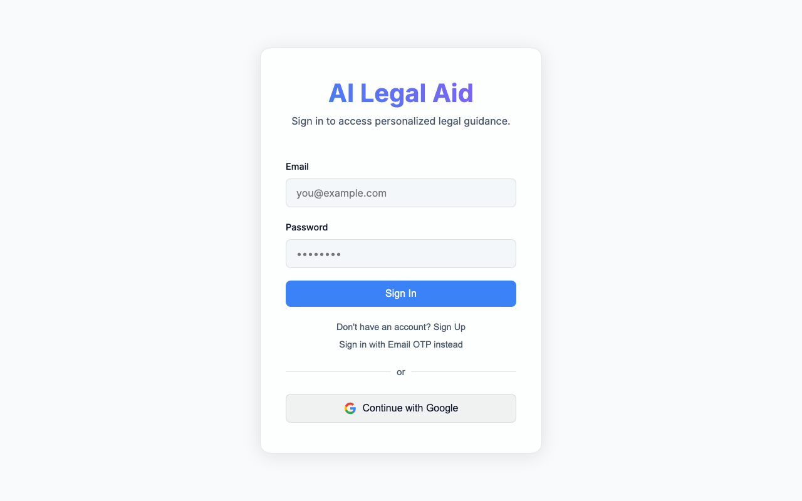
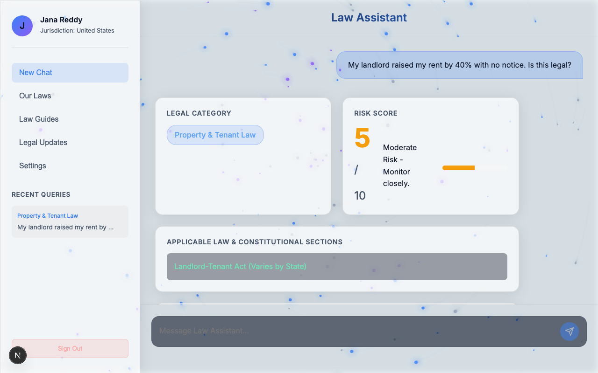

# AI Legal Aid ⚖️


An intelligent, AI-powered Legal Aid Triage System built to provide accessible, jurisdiction-aware legal guidance. 

---

## 📖 Project Description

### Problem
Access to preliminary legal guidance is often expensive, intimidating, and confusing for the general public. Many people facing potential legal issues do not know how serious their situation is, what laws apply to them, or what documentation they need to begin resolving their problem. 

### Solution
**AI Legal Aid** is a proactive triage system. Users input their specific situation, and the platform queries an advanced AI model (Google Gemini) to return structured, actionable legal guidance categorized by severity and legal branch. The system adjusts its analysis based on the user's selected jurisdiction (country), ensuring the advice is relevant.

### Goals & Intent
- **Democratize Legal Knowledge:** Provide instant, understandable legal context to everyday citizens.
- **Risk Assessment:** Help users immediately understand the severity of their situation via a 1-10 Risk Score so they know when to urgently seek professional counsel.
- **Preparation:** Equip users with a checklist of required documents before they meet with actual lawyers, saving time and money.

---

## 🚀 Functional Product / Prototype

This repository contains a **fully working, production-ready web application prototype**. It is not just a UI mockup.

**Key Functional Features:**
- **Jurisdiction Aware:** Users select their country on the dashboard onboarding. AI advice dynamically pivots to reference the specific laws of that region.
- **AI Triage Chat:** A seamless chat interface where users describe their situation.
- **Structured Assessment Results:** The application parses the AI response into digestible cards detailing:
  - Legal Category (e.g., Property Law, Criminal Law)
  - Applicable Sections of Law
  - Potential Penalties, Fines, & Tenure
  - AI Legal Guidance (Next Steps)
  - Required Documentation Checklist
  - Dynamic Risk Score Meter (1-10 scale)
- **Authentication & History:** Full Supabase Auth (Email OTP/Password/Google). The application logs every query securely so users can review their past legal analyses.

---

## 🎥 Video Demonstration

Watch the full walkthrough of the application:
- **[YouTube Video](https://youtu.be/8v8fQqGGslE?si=7Qp79hVODCh5VKQp)**
- **[Google Drive Link](https://drive.google.com/file/d/18WdIx-5VPis1aXKzTb4xLQ26VzrPvfls/view?usp=sharing)**

---

## 📸 Screenshots / Images

### 1. Authentication Screen


### 2. Main Dashboard & Chat


---

## 🛠️ Technical Details

This project leverages a modern web stack designed for speed, type safety, and seamless AI integration.

- **Framework:** Next.js 16 (App Router)
- **Language:** TypeScript 
- **Styling:** CSS Modules with glassmorphism UI design
- **State Management:** React `useState` & `useEffect`, Zustand
- **Database:** Supabase (PostgreSQL) - Stores user profiles and legal query history.
- **Authentication:** Supabase Auth (`@supabase/ssr`) supporting Password, Magic Link, and Google OAuth.
- **PWA Ready:** Configured with `next-pwa` for mobile app-like installations.
- **Font Optimization:** `next/font` using Vercel's Geist font family.

---

## 🤖 AI / Security Explanation

### AI Integration
The core triage mechanic is powered by **Google's `gemini-2.5-flash`** model via the `@google/genai` SDK.

**How it works:**
1. **System Prompting:** The AI is strictly prompted to act as an "AI-Powered Legal Aid Triage System." It is forced to evaluate the user's query against their selected country.
2. **Structured Output Enforcement:** We enforce `responseMimeType: "application/json"` and provide a strict JSON schema within the prompt. This ensures the AI always returns exactly the keys our React frontend expects (`category`, `applicable_sections`, `risk_score`, etc.) instead of freeform text.
3. **Local Fallback:** If the API fails or rate-limits, the API route automatically catches the error and falls back to a minimal local offline legal database (`findLocalAnalysis`), guaranteeing the app never completely breaks for the user.

### Security
- **Row Level Security (RLS):** *(If implemented in Supabase)* Ensures users can only fetch their own query history.
- **Environment Variables:** All API keys (`GEMINI_API_KEY`, Supabase anon key) are securely loaded server-side or via standard Next.js `.env` practices, preventing scraping.

---

## 💻 Running the Project Locally

To test the application on your own machine:

1. **Clone the repository:**
   ```bash
   git clone https://github.com/Jana-Reddy/AI-Legal-Aid.git
   cd AI-Legal-Aid
   ```

2. **Install dependencies:**
   ```bash
   npm install
   ```

3. **Environment Setup:**
   Create a `.env.local` file in the root directory and add the following:
   ```env
   NEXT_PUBLIC_SUPABASE_URL=your_supabase_project_url
   NEXT_PUBLIC_SUPABASE_ANON_KEY=your_supabase_anon_key
   GEMINI_API_KEY=your_google_gemini_api_key
   ```

4. **Database Setup:**
   Run the provided `supabase_schema.sql` file in your Supabase SQL Editor to create the `profiles` and `legal_queries` tables.

5. **Start the Development Server:**
   ```bash
   npm run dev
   ```

6. Open [http://localhost:3000](http://localhost:3000) in your browser.

---

## 👥 Contributors

- **Jana Reddy** - [@Jana-Reddy](https://github.com/Jana-Reddy)
